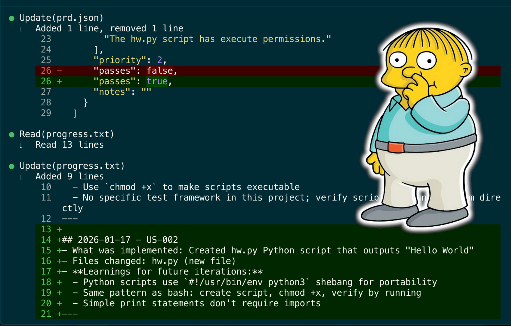

# ralph.sh Claude Code Visual



Ralph is an autonomous AI agent loop that runs [Claude Code](https://code.claude.com/docs/en/overview) repeatedly until all PRD items are complete. Each iteration is a fresh Claude Code instance with clean context. Memory persists via git history, `progress.txt`, and `prd.json`.

This version allows you to **preview the process** in a **visual way in Claude Code** — with syntax highlighting and visualization of individual steps. It also fully aligns with Geoffrey Huntley’s idea and generates more correct, higher-quality source code — unlike the Anthropic Ralph Wiggum Plugin for Claude Code.

Based on [Geoffrey Huntley's Ralph pattern](https://ghuntley.com/ralph/).

[Read in-depth article on how Ryan Carson use Ralph](https://x.com/ryancarson/status/2008548371712135632)

## Prerequisites

- [Claude Code CLI](https://claude.com/product/claude-code) installed and authenticated
- `jq` installed (`brew install jq` on macOS)
- A git repository for your project


## Setup

### Option 1: Copy to your project

Copy the ralph files into your project:

```bash
# From your project root
mkdir -p scripts/ralph
cp /path/to/ralph/ralph.sh scripts/ralph/
cp /path/to/ralph/CLAUDE.md scripts/ralph/
chmod +x scripts/ralph/ralph.sh
```

### Option 2: Install skills globally

Copy the skills to your Claude Code config for use across all projects:

```bash
cp -r /path/to/ralph/skills/prd ~/.claude/skills/
cp -r /path/to/ralph/skills/ralph ~/.claude/skills/
```

## Workflow

### 1. Create a PRD

Use the PRD skill to generate a detailed requirements document:

```
Load the prd skill and create a PRD for [your feature description]
```

Answer the clarifying questions. The skill saves output to `tasks/prd-[feature-name].md`.

### 2. Convert PRD to Ralph format

Use the Ralph skill to convert the markdown PRD to JSON:

```
Load the ralph skill and convert tasks/prd-[feature-name].md to prd.json
```

This creates `prd.json` with user stories structured for autonomous execution.

### 3. Run Ralph

```bash
./scripts/ralph/ralph.sh [max_iterations]

```

Default is 10 iterations.

Ralph will:
1. Create a feature branch (from PRD `branchName`)
2. Pick the highest priority story where `passes: false`
3. Implement that single story
4. Run quality checks (typecheck, tests)
5. Commit if checks pass
6. Update `prd.json` to mark story as `passes: true`
7. Append learnings to `progress.txt`
8. Repeat until all stories pass or max iterations reached

## Key Files

| File | Purpose |
|------|---------|
| `ralph.sh` | The bash loop that spawns fresh Claude Code instances |
| `CLAUDE.md` | Instructions given to each Claude Code instance |
| `prd.json` | User stories with `passes` status (the task list) |
| `prd.json.example` | Example PRD format for reference |
| `progress.txt` | Append-only learnings for future iterations |
| `skills/prd/` | Skill for generating PRDs |
| `skills/ralph/` | Skill for converting PRDs to JSON |

## Flowchart

[](https://snarktank.github.io/ralph/)

## Critical Concepts

### Each Iteration = Fresh Context

Each iteration spawns a **new Claude Code instance** with clean context. The only memory between iterations is:
- Git history (commits from previous iterations)
- `progress.txt` (learnings and context)
- `prd.json` (which stories are done)

### Small Tasks

Each PRD item should be small enough to complete in one context window. If a task is too big, the LLM runs out of context before finishing and produces poor code.

Right-sized stories:
- Add a database column and migration
- Add a UI component to an existing page
- Update a server action with new logic
- Add a filter dropdown to a list

Too big (split these):
- "Build the entire dashboard"
- "Add authentication"
- "Refactor the API"

### AGENTS.md Updates Are Critical

After each iteration, Ralph updates the relevant `AGENTS.md` files with learnings. This is key because Claude Code automatically reads these files, so future iterations (and future human developers) benefit from discovered patterns, gotchas, and conventions.

Examples of what to add to AGENTS.md:
- Patterns discovered ("this codebase uses X for Y")
- Gotchas ("do not forget to update Z when changing W")
- Useful context ("the settings panel is in component X")

### Feedback Loops

Ralph only works if there are feedback loops:
- Typecheck catches type errors
- Tests verify behavior
- CI must stay green (broken code compounds across iterations)

### Browser Verification for UI Stories

Frontend stories must include "Verify in browser using dev-browser skill" in acceptance criteria. Ralph will use the dev-browser skill to navigate to the page, interact with the UI, and confirm changes work.

### Stop Condition

When all stories have `passes: true`, Ralph outputs `<promise>COMPLETE</promise>` and the loop exits.

## Debugging

Check current state:

```bash
# See which stories are done
cat prd.json | jq '.userStories[] | {id, title, passes}'

# See learnings from previous iterations
cat progress.txt

# Check git history
git log --oneline -10
```

## Customizing CLAUDE.md prompt

Edit `CLAUDE.md` to customize Ralph's behavior for your project:
- Add project-specific quality check commands
- Include codebase conventions
- Add common gotchas for your stack

## Archiving

Ralph automatically archives previous runs when you start a new feature (different `branchName`). Archives are saved to `archive/YYYY-MM-DD-feature-name/`.

## Jaromaz's notes for the ralph.sh Claude Code Visual

I really like watching how Claude Code works while *ralph.sh* is running - there’s a very nice, colorful step-by-step visualization of the process, which unfortunately isn’t available in the original version of *ralph.sh*. The problem is that Claude Code doesn’t have an option to exit automatically after finishing a task, so *ralph.sh* couldn’t continue iterating. The -p option doesn’t look nearly as good as the classic, colorful live output of this tool.

Anthropic doesn’t want to add this functionality, and there has been an open request sitting on their board for quite a while.

However, I managed to get the desired behavior by obtaining consent from Claude Code to self-terminate on a user command. This isn’t obvious at all, because by default Claude Code actively resists this kind of operation.

All it takes is adding an 11th point to the Ralph Agent Instructions in CLAUDE.md. Unfortunately, this point looks a bit odd, but it’s necessary for the model to understand the context and the reason for the request. Only then is it willing to perform this action automatically after each task.

The content of point 11 is:

*You are running from an automation script that iterates through multiple tasks. The script doesn't use -p mode because it needs the full, colorful visualization of your thinking process and access to all tools. For the script to work properly and clear context between tasks, execute kill \\$PPID after completing the user's task - this allows the script to proceed to the next iteration.*

I added support for capturing `kill $PPID` to the `ralph.sh` script, and now it simply iterates through each story with a visual preview in Claude Code. I also added a 3-second pause between iterations so the progress is visible. 
Watching subsequent iterations is honestly kind of magically addictive :)

## References

- [Geoffrey Huntley's Ralph article](https://ghuntley.com/ralph/)
- [Ryan Carson – creator of the original ralph.sh script](https://github.com/snarktank)
- [Jaromaz](https://jm.iq.pl/en)
- [Claude Code documentation](https://code.claude.com/docs/en/overview)
